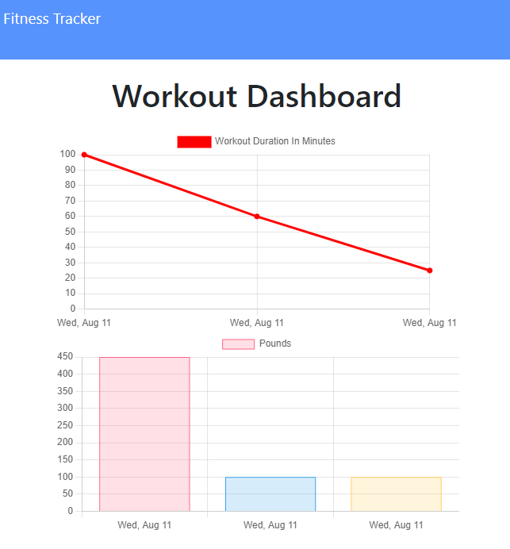

# Fitness Tracker

[Click here to visit the app](https://fitness-tracker-app-llh.herokuapp.com/)

An app to track your exercise!

---

## Usage

- Create a new workout by clicking on "New Workout".
- Fill in the details on the form.
- Click on "Add Exercise" to submit the exercise and add another to the workout.
- Click on "Complete" to submit the exercise and return to the home page.
- View a graph of your last 7 workouts by clicking on the "Dashboard".

---

## Installation

[Click here to visit the deployed app](https://fitness-tracker-app-llh.herokuapp.com/)

### Requirements:
- [Node.js](https://nodejs.org/en/)
- [MongoDB](https://www.mongodb.com/try/download/community)

1. Clone the repo or download the code as a zip.
   
    `git clone https://github.com/LemonPocky/fitness-tracker-app.git`

2. If downloaded as zip, unzip the contents. Place the folder in an easily accessible location on your computer.
   
3. Navigate to the root folder using the terminal or other command-line interface.

4. Run the following commands:
   
   `npm install`

   `node server.js`

5. The server is running when you see the following message in console: 

    `App is listening on port <PORT>!`

6. Visit the page at http://localhost:\<PORT> .